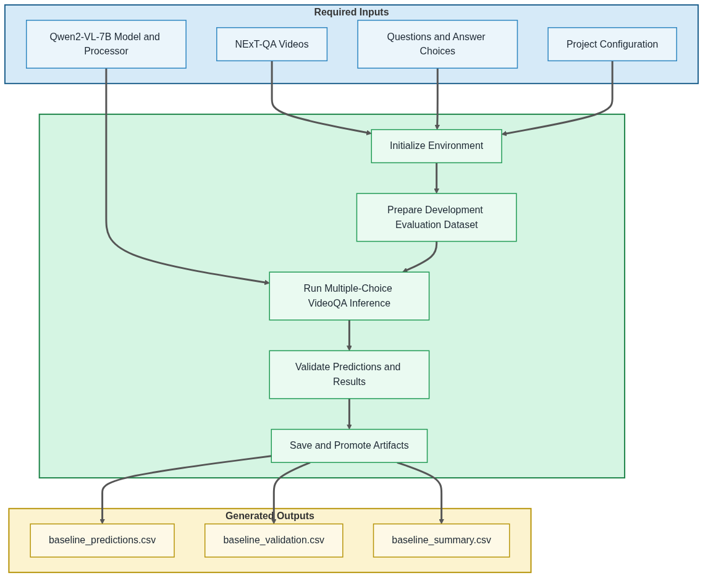

# 01 Run Qwen2VL Baseline

  <strong>Open Notebook in Google Colab ➡️</strong>
  

**IMPORTANT: This notebook is part of a complete VideoQA tutorial available through the project's public GitHub repository. It may be viewed directly on GitHub without an account. Running the notebook in Google Colab requires a Google account. During execution, the notebook automatically restores the required project archives from locally available files, a mounted Google Drive when available, or the project's public Hugging Face dataset repository. Alternatively, the repository may be cloned or downloaded, and the notebooks can be run locally using Jupyter or any compatible notebook environment.**

**NOTE:** Google Drive is mounted with read-only access by default when running the notebooks in Google Colab. Steps that would normally save artifacts instead report the intended output location. Write support may be enabled by modifying the notebook configuration.

## Purpose

This notebook performs development-subset baseline Video Question Answering (VideoQA) experiments for the NExT-QA benchmark using the Qwen2-VL-7B multimodal foundation model. It restores the required project resources, generates standardized prediction, validation, and summary artifacts, and establishes the baseline reference used to compare the project's representation-based VideoQA pipelines.

Development-subset evaluation enables rapid experimentation and workflow validation while minimizing computational cost before larger-scale experiments.

## Workflow Overview

The following diagram summarizes the notebook workflow, including the required inputs, primary processing stages, and generated output artifacts.

## Inputs

* Qwen2-VL-7B multimodal model
* NExT-QA video dataset
* NExT-QA question-answer annotations
* Project configuration settings

## Processing Summary

* Initialize the notebook environment and restore the required project resources.
* Configure the baseline VideoQA experiment.
* Verify GPU runtime readiness and model dependencies.
* Load the Qwen2-VL-7B model and processor.
* Prepare the development evaluation dataset.
* Execute development-subset multiple-choice VideoQA inference.
* Validate generated prediction artifacts.
* Save prediction artifacts locally.
* Optionally promote prediction artifacts to Google Drive.
* Display representative prediction samples.
* Finalize baseline artifacts for downstream evaluation.

## Generated Artifacts

These outputs provide the baseline performance reference used throughout the remainder of the project.

* outputs/baseline/baseline_predictions.csv
* outputs/baseline/baseline_validation.csv
* outputs/baseline/baseline_summary.csv

## Runtime Requirements

Development and testing were performed in Google Colab. Standard CPU runtimes are sufficient for repository setup, project resource restoration, dataset preparation, and file operations, while GPU acceleration (NVIDIA L4 preferred) is required for Qwen2-VL-7B inference.

Baseline VideoQA development-subset experiments were evaluated using the NVIDIA L4 GPU. The L4 successfully executed Qwen2-VL-7B inference and achieved an average runtime of approximately 2.2 seconds per evaluation sample during testing.

The NVIDIA T4 GPU was evaluated as a lower-tier alternative. Although the model could be loaded successfully, inference frequently encountered CUDA out-of-memory errors.

## Notes

* Representative video frames are sampled directly from the source videos during inference.
* Runtime performance depends on the selected evaluation dataset size, inference configuration, and available GPU resources.
* GPU memory requirements vary with the number of sampled video frames and model generation parameters.
* Notebook 08 restores the generated prediction artifacts and evaluates them using the same experiment-agnostic workflow applied to all implemented VideoQA methods.

