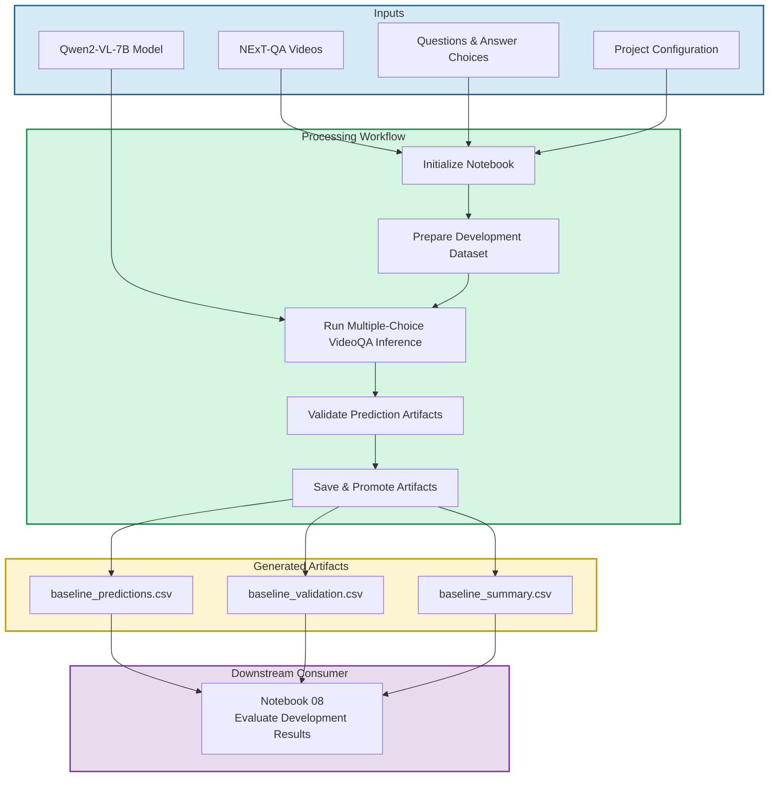

# 01 Run Qwen2VL Baseline

  <strong>Open Notebook in Google Colab ➡️</strong>
  

## Purpose

This notebook performs development-subset baseline Video Question Answering (VideoQA) experiments for the NExT-QA benchmark dataset using the Qwen2-VL-7B multimodal foundation model. The notebook generates standardized prediction, validation, and summary artifacts that establish the baseline reference for comparison with the project's representation-based VideoQA methods.

Development-subset experiments enable rapid experimentation, workflow validation, and parameter tuning while minimizing computational cost. The validated baseline configuration provides the reference against which the CLIP representation method and the self-supervised autoencoder representation method are evaluated using the common evaluation framework implemented in Notebook 08.

## Workflow Overview

The following diagram summarizes the Notebook 01 workflow. It identifies the required inputs, the primary processing stages, the generated artifacts, and the downstream notebook that consumes the results.

## Inputs

* NExT-QA video dataset
* NExT-QA question-answer annotation files
* NExT-QA metadata resources
* Project configuration settings
* Shared utility modules and helper functions
* Qwen2-VL-7B model and processor

## Outputs

### Generated Artifacts

These outputs provide the baseline performance reference used throughout the remainder of the project.

* outputs/baseline/baseline_predictions.csv
* outputs/baseline/baseline_validation.csv
* outputs/baseline/baseline_summary.csv

### Generated Results

* Baseline prediction artifact
* Baseline validation artifact
* Baseline summary artifact
* Multiple-choice prediction accuracy
* Inference timing statistics
* Runtime projections
* Sample predictions for qualitative review

## Processing Workflow

* Initialize the notebook environment and restore the NExT-QA dataset.
* Configure the baseline VideoQA experiment.
* Verify GPU runtime readiness and model dependencies.
* Load the Qwen2-VL-7B model and processor.
* Prepare the development evaluation dataset.
* Execute development-subset multiple-choice VideoQA inference.
* Validate generated prediction artifacts.
* Save prediction artifacts locally.
* Promote prediction artifacts to Google Drive.
* Display representative prediction samples.
* Finalize baseline artifacts for downstream evaluation.

## Runtime Requirements

Development and testing were performed within the Google Colab environment.

Standard CPU runtime environments are used for dataset preparation, repository setup, and file operations. GPU acceleration (NVIDIA L4 preferred) is required for Qwen2-VL-7B inference.

Baseline VideoQA development-subset experiments were evaluated using the NVIDIA L4 GPU. The L4 successfully executed Qwen2-VL-7B inference and achieved an average runtime of approximately 2.2 seconds per evaluation sample during testing.

The NVIDIA T4 GPU was evaluated as a lower-tier alternative. Although the model could be loaded successfully, inference frequently encountered CUDA out-of-memory errors.

## Notes

* This notebook performs development-subset baseline VideoQA using direct Qwen2-VL-7B multimodal inference.
* Representative video frames are sampled directly from the source videos during inference.
* Prediction artifacts include multiple-choice predictions, validation results, summary statistics, and inference timing information.
* Runtime performance depends on the selected evaluation dataset size, inference configuration, and available GPU resources.
* GPU memory requirements vary with the number of sampled video frames and model generation parameters.
* This notebook serves as the baseline method for comparison with the project's representation-based VideoQA methods.
* Baseline prediction artifacts are generated locally, validated, and promoted to Google Drive.
* Notebook 08 restores these artifacts and evaluates them using the same experiment-agnostic evaluation workflow applied to all implemented VideoQA methods.
* The generated prediction, validation, and summary artifacts provide the baseline reference used throughout the remainder of the project.

