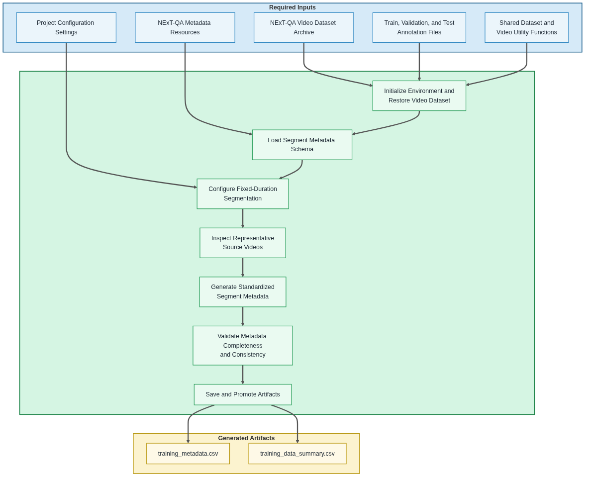

# 02 Prepare Autoencoder Segment Metadata

  <strong>Open Notebook in Google Colab ➡️</strong>
  

## Purpose

This notebook prepares standardized segment metadata for the self-supervised autoencoder pipeline using the NExT-QA video dataset.

Rather than duplicating video content, the notebook generates structured metadata describing fixed-duration video segments, including video identifiers, dataset splits, timestamps, representative frames, and segment properties. The generated metadata serves as a reusable catalog of video segments spanning the training, validation, and test splits.

Although the generated artifact is named `training_metadata.csv`, it intentionally includes segment metadata for all NExT-QA dataset splits. The retained `split` field enables downstream notebooks to select the appropriate subset for model training, development evaluation, or future benchmark testing.

The resulting segment metadata establishes a consistent segmentation strategy that supports reproducible self-supervised representation learning and downstream comparison with pretrained CLIP video representations.

## Workflow Overview

The following diagram summarizes the notebook workflow, including the required inputs, primary processing stages, and generated output artifacts.

  

## Inputs

- NExT-QA video dataset
- NExT-QA question-answer annotations
- Project configuration settings
- Video segmentation configuration

## Processing Summary

1. Initialize the project environment and restore the NExT-QA video dataset.
2. Load the shared autoencoder segment metadata schema.
3. Configure video segmentation parameters.
4. Inspect representative source videos.
5. Generate standardized video segment metadata.
6. Validate segment metadata completeness and consistency.
7. Save segment metadata and summary artifacts.
8. Preview representative segment metadata records.
9. Summarize the completed segment metadata preparation workflow.
10. Promote generated metadata artifacts to Google Drive.

## Generated Artifacts

The notebook generates the following persistent artifacts for downstream autoencoder training and evaluation:

- `experiments/<experiment>/training/metadata/training_metadata.csv`
- `experiments/<experiment>/training/reports/training_data_summary.csv`

### Video Segmentation Strategy

Videos are segmented using a fixed-duration segmentation strategy.

Each generated segment represents a contiguous temporal region within a source video and is used as a unit for self-supervised autoencoder training.

Each segment includes:

* Start, midpoint, and end timestamps
* Frame boundary indices
* Representative frame index (midpoint frame)
* Video properties (fps, resolution, frame count)
* Optional motion and scene-change metrics (disabled by default)

These standardized video segments provide a consistent and reproducible unit of video data for downstream learning tasks.

### Segment Metadata Field Definitions

| Field                        | Description |
|----------------------------|-------------|
| `segment_id`              | Unique identifier for each training segment. |
| `video_id`                | NExT-QA video identifier associated with the segment. |
| `split`                   | Dataset split (`train`, `val`, or `test`). |
| `video_path`              | Local path to the source video file. |
| `segment_index`           | Sequential segment number within a video. |
| `segment_level`           | Hierarchy level (currently flat = 0). |
| `parent_segment_id`       | Parent segment identifier (unused in current implementation). |
| `segment_strategy`        | Segmentation method used (fixed-duration). |
| `start_time_sec`          | Segment start time in seconds. |
| `midpoint_time_sec`       | Segment midpoint time in seconds. |
| `end_time_sec`            | Segment end time in seconds. |
| `segment_duration_sec`    | Duration of the segment. |
| `start_frame_idx`         | Frame index at segment start. |
| `midpoint_frame_idx`      | Frame index at segment midpoint. |
| `end_frame_idx`           | Frame index at segment end. |
| `representative_frame_index` | Representative frame (currently midpoint frame). |
| `fps`                     | Frames per second of the video. |
| `frame_count`             | Total number of frames in the video. |
| `width`                   | Frame width in pixels. |
| `height`                  | Frame height in pixels. |
| `motion_score`            | Optional motion metric (disabled by default). |
| `scene_change_score`      | Optional scene transition metric (disabled by default). |

### Standard and Enhanced Segmentation Parameters

This notebook implements a **fixed baseline segmentation strategy** for autoencoder training data generation.

| Parameter | Description | Current Implementation | Future Extensions |
|----------|-------------|-----------------------|------------------|
| Segment Duration | Length of each training segment | Fixed 6-second segments | Adaptive segment lengths |
| Segment Overlap | Temporal overlap between segments | No overlap | 25% / 50% overlap |
| Segment Selection | Retained segments per video | All segments retained | Ranked or filtered selection |
| Motion Analysis | Motion-based feature extraction | Disabled | Motion-based scoring |
| Scene Detection | Scene boundary detection | Disabled | Scene-aware segmentation |
| Representative Frame | Frame representing each segment | Midpoint frame | Key-frame selection methods |
| Segment Ranking | Importance scoring | Not applied | Motion/scene-based ranking |
| Segment Filtering | Removal of low-quality segments | Not applied | Quality-based filtering |
| Metadata Features | Stored attributes per segment | Basic metadata only | Extended feature sets |

### Dataset Statistics

The current segmentation configuration generates a reusable segment metadata dataset for the complete NExT-QA benchmark.

The generated metadata includes:

* Segment metadata for all **5,440** NExT-QA source videos
* Fixed-duration **6-second** video segments
* One representative midpoint frame for each segment
* Motion and scene analysis disabled in the baseline configuration
* Original dataset split (`train`, `val`, or `test`) retained for every segment

The total number of generated segment metadata records depends on the configured segmentation strategy and the durations of the source videos. By retaining the original dataset split for each segment, the metadata can be reused throughout the project for autoencoder training, development evaluation, and future benchmark testing without regenerating the segmentation metadata.

