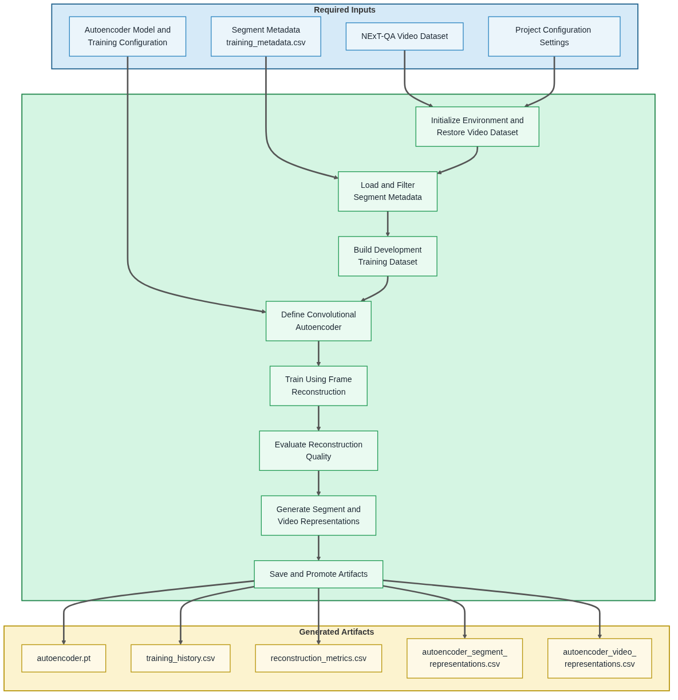

# 03 Train Video Autoencoder

  <strong>Open Notebook in Google Colab ➡️</strong>
  

---

## Purpose

This notebook trains a self-supervised convolutional autoencoder using the standardized segment metadata prepared in Notebook 02. The objective is to learn compact latent video representations from NExT-QA videos without using question-answer supervision.

The notebook constructs a reproducible training dataset from the NExT-QA training split, defines the convolutional autoencoder architecture, and trains the model using frame reconstruction as the self-supervised learning objective.

Following training, the notebook inspects the complete flow of information through the trained autoencoder, evaluates reconstruction quality, and applies the frozen encoder to selected videos from the training, validation, and test splits.

It generates standardized segment/frame-level and video-level latent representations, together with the trained autoencoder model and experiment artifacts, for validation in Notebook 04 and downstream representation-based VideoQA experiments.

## Step 0 — Notebook Configuration

Each notebook begins with **Step 0**, which centralizes the notebook's user-configurable settings. Before executing the notebook, review these options to select the desired experiment configuration, dataset scope, runtime behavior, and optional Google Drive write support. The default settings are appropriate for the documented tutorial workflow.

## Workflow Overview

The following diagram summarizes the notebook workflow, including the required inputs, primary processing stages, and generated output artifacts.

## Inputs

- NExT-QA video dataset
- Training segment metadata (`training_metadata.csv`)
- Project configuration settings
- Autoencoder model and training configuration

## Processing Summary

1. Initialize the notebook environment and restore the NExT-QA video dataset.
2. Load standardized training segment metadata.
3. Configure the autoencoder training experiment.
4. Build the training dataset.
5. Preview representative training segments.
6. Define the convolutional autoencoder architecture.
7. Train the autoencoder using frame reconstruction.
8. Inspect the sequential flow of information through the trained autoencoder, visualizing each major encoder and decoder stage, the learned latent representation, reconstruction quality, and compression characteristics.
9. Compute reconstruction metrics.
10. Generate standardized segment-level and video-level latent representations.
11. Save experiment artifacts and export results.

## Generated Artifacts

The notebook generates the following persistent artifacts for downstream validation and representation-based VideoQA experiments.

- `experiments/<experiment>/autoencoder/models/autoencoder.pt`
- `experiments/<experiment>/autoencoder/training/training_history.csv`
- `experiments/<experiment>/autoencoder/evaluation/reconstruction_metrics.csv`
- `experiments/<experiment>/autoencoder/representations/autoencoder_segment_representations.csv`
- `experiments/<experiment>/autoencoder/representations/autoencoder_video_representations.csv`

### Autoencoder Training Strategy

This notebook implements a self-supervised convolutional autoencoder trained on frames sampled from fixed-duration video segments generated in Notebook 02.

The encoder progressively compresses each input frame into a compact latent representation, and the decoder reconstructs an approximation of the original frame from that representation.

Frame reconstruction serves as the self-supervised learning objective used to optimize the encoder. The resulting latent representation is intended to preserve the visual information required for accurate reconstruction while providing a compact representation suitable for downstream VideoQA experiments.

### Autoencoder Configuration Parameters

The baseline configuration defines the model and training behavior used for representation learning.

| Parameter | Description |
|----------|-------------|
| Frame Size | Input resolution for sampled video frames |
| Frames per Segment | Number of frames sampled from each training segment |
| Batch Size | Number of samples per training step |
| Epochs | Number of training passes over dataset |
| Latent Dimension | Size of the encoder embedding space |
| Learning Rate | Optimization step size |
| Training Split Size | Number of videos used for development experiments |

Future experiments may modify these parameters to evaluate their impact on embedding quality and downstream classification performance.

### Autoencoder Component Summary

The following table summarizes the major components of the convolutional autoencoder and their roles in representation learning.

| Component | Purpose | Output |
|-----------|---------|--------|
| **Encoder** | Progressively compresses the input frame into increasingly compact feature representations. | High-level visual features |
| **Latent Representation** | Stores the learned visual features in a compact 256-dimensional embedding used for reconstruction and downstream representation generation. | Compact latent vector |
| **Decoder** | Reconstructs an approximation of the original frame from the latent representation. | Reconstructed image |
| **Reconstruction Loss** | Measures the difference between the original and reconstructed frames during training, providing the self-supervised learning objective used to optimize the encoder and decoder. | Training loss (MSE) |

Together, these components enable the autoencoder to learn compact visual representations without requiring question-answer supervision. The quality of the learned latent representation is assessed through reconstruction performance and subsequently evaluated in downstream representation-based VideoQA experiments.

### Reconstruction Metrics

Reconstruction quality is monitored during training using standard image reconstruction metrics:

| Metric | Description |
|--------|-------------|
| MSE | Mean Squared Error between original and reconstructed frames |
| MAE | Mean Absolute Error between original and reconstructed frames |
| PSNR | Peak Signal-to-Noise Ratio measuring reconstruction fidelity |

These metrics are used to track training stability and ensure the autoencoder is learning meaningful visual structure in the embedding space.

Although these metrics quantify reconstruction fidelity, they do not demonstrate that the learned latent representation captures high-level semantic concepts or aligns with language-based embedding spaces. Establishing semantic organization requires additional downstream evaluation.

### Autoencoder Information Flow Inspection

Following training, the notebook performs a deterministic inspection of a representative training frame as it passes through every major stage of the autoencoder. The inspection visualizes:

- Original input frame
- Encoder feature maps
- Flattened representation
- Latent representation
- Expanded latent representation
- Decoder feature maps
- Reconstructed frame
- Absolute reconstruction error
- Compression summary

Each convolutional stage displays the feature map with the highest activation variance, providing a representative visualization of the learned features at that stage. Because feature-map channels are learned independently within each layer, the representative channel may differ between successive stages. Together, these visualizations illustrate how the encoder compresses visual information into a compact latent representation and how the decoder reconstructs the original frame.

The inspection concludes by summarizing the compression ratio and reconstruction quality while emphasizing that successful reconstruction alone does not demonstrate semantic organization of the latent space. Establishing semantic organization requires additional evaluation using downstream tasks such as representation-based VideoQA.

### Experiment Configuration

The notebook supports both development-scale and full-dataset training experiments. Development experiments enable rapid parameter tuning and debugging, while full-dataset training produces the representations used for downstream VideoQA evaluation. The baseline configuration includes:

* Development subset or full NExT-QA training split
* Standardized training metadata generated by Notebook 02
* Fixed frame sampling per segment
* Convolutional autoencoder architecture
* Self-supervised frame reconstruction objective
* GPU-accelerated training when available

This configuration provides a reproducible environment for evaluating autoencoder training strategies before scaling to full-dataset experiments.

