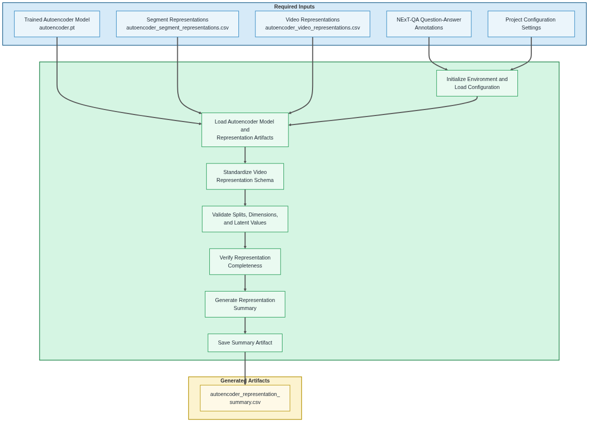

# 04 Validate Autoencoder Video Representations

  <strong>Open Notebook in Google Colab ➡️</strong>
  

## Purpose

This notebook loads and validates the standardized autoencoder representations generated by Notebook 03 for downstream representation-based VideoQA experiments.

Rather than training the autoencoder or generating new latent embeddings, the notebook restores the trained model and previously generated representation artifacts, standardizes the video representation schema, validates the resulting dataset, and generates a representation summary report.

The validated `autoencoder_video` representation dataset serves as the experiment-specific video input to the shared Fusion MLP classifier implemented in Notebook 07. Notebook 07 selects the required training and validation records and merges them with the corresponding NExT-QA annotations and shared CLIP text embeddings.

## Workflow Overview

The following diagram summarizes the notebook workflow, including the required inputs, primary processing stages, and generated output artifacts.

## Inputs

- Trained autoencoder model (`autoencoder.pt`)
- Segment-level autoencoder representations (`autoencoder_segment_representations.csv`)
- Video-level autoencoder representations (`autoencoder_video_representations.csv`)
- NExT-QA question-answer annotations
- Project configuration settings

## Processing Summary

1. Initialize the notebook environment and load project configuration.
2. Load the trained autoencoder model and existing representation artifacts.
3. Standardize the video representation schema for Notebook 07 compatibility.
4. Validate dataset splits, embedding dimensions, metadata fields, segment counts, and latent values.
5. Verify representation completeness and consistency.
6. Generate the autoencoder representation summary.
7. Save the summary artifact and display representative records.

## Generated Artifacts

- experiments/<experiment>/autoencoder/representations/autoencoder_representation_summary.csv

## Runtime Requirements

Development and testing were performed in Google Colab. Repository setup, configuration loading, annotation processing, representation standardization, and validation execute efficiently within the Colab environment.

The notebook primarily loads and validates representation artifacts previously generated by Notebook 03. It also restores the trained autoencoder model for experiment verification but does not perform additional training or latent representation extraction. Its computational requirements are therefore substantially lower than those of Notebook 03.

## Notes

* This notebook consumes the trained model and representation artifacts generated by Notebook 03.
* Segment-level and video-level representation records retain their original training, validation, and test split labels.
* The notebook does not perform VideoQA inference or classifier training.
* Notebook 07 selects the required training and validation video representations and merges them with NExT-QA annotations and shared CLIP text embeddings.

