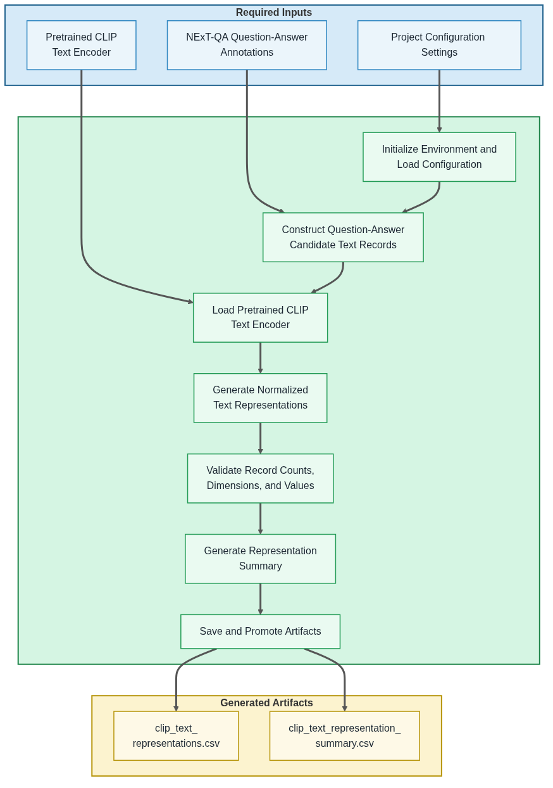

# 05 Generate CLIP Text Representations

  <strong>Open Notebook in Google Colab ➡️</strong>
  

## Purpose

This notebook generates shared CLIP text representations for NExT-QA question–answer candidates. These normalized semantic representations provide the common `clip_text` representation source used by the representation-based VideoQA methods.

For each NExT-QA annotation record, the notebook constructs five combined question–answer text inputs—one for each multiple-choice candidate answer. Each combined text input is encoded as a normalized 512-dimensional CLIP representation.

The generated `clip_text` artifacts are shared across the CLIP representation method and the self-supervised autoencoder representation method. Notebook 07 combines these shared question–answer candidate representations with the selected video representation source using the configured representation-based VideoQA method.

## Step 0 — Notebook Configuration

Each notebook begins with **Step 0**, which centralizes the notebook's user-configurable settings. Before executing the notebook, review these options to select the desired experiment configuration, dataset scope, runtime behavior, and optional Google Drive write support. The default settings are appropriate for the documented tutorial workflow.

## Workflow Overview

The following diagram summarizes the notebook workflow, including the required inputs, primary processing stages, and generated output artifacts.

## Inputs

- NExT-QA question-answer annotations
- Project configuration settings
- Pretrained CLIP text encoder

## Processing Summary

1. Initialize the notebook environment and load project configuration.
2. Construct five combined question-answer candidate text records for each NExT-QA annotation.
3. Load the pretrained CLIP text encoder.
4. Generate normalized 512-dimensional CLIP text representations.
5. Validate record counts, metadata fields, embedding dimensions, and embedding values.
6. Generate the CLIP text representation summary.
7. Save and promote the generated artifacts.

## Generated Artifacts

The notebook generates the following persistent shared artifacts for downstream representation-based VideoQA experiments:

- `representations/clip/text/clip_text_representations.csv`
- `representations/clip/text/clip_text_representation_summary.csv`

## Notes

- This notebook generates shared `clip_text` representations only; video representations are prepared separately by Notebooks 04 and 06.
- One combined question–answer representation is generated for each candidate answer.
- Each NExT-QA annotation therefore produces five CLIP text representation records.
- The combined text input contains the complete question and one candidate answer.
- Shared `clip_text` representations are generated once and reused by the representation-based VideoQA methods.
- Notebook 07 combines these text representations with either `clip_video` or `autoencoder_video` representations using the configured scoring or classifier method.
- Development mode generates representations for a reproducible sample of annotation records from the configured evaluation split.
- Full-dataset mode generates representations for all available NExT-QA annotation records and writes the shared artifacts to Google Drive.

