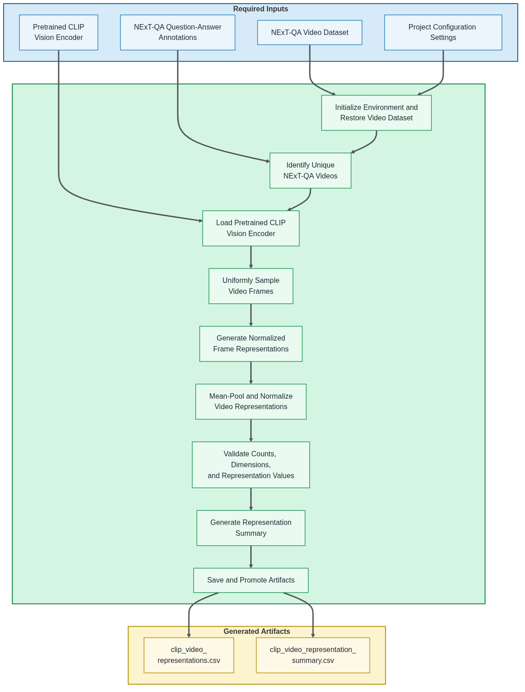

# 06 Generate CLIP Video Representations

  <strong>Open Notebook in Google Colab ➡️</strong>
  

## Purpose

This notebook generates pretrained CLIP video representations for the NExT-QA videos referenced by the project annotation dataset. These standardized `clip_video` representations provide the video representation source for CLIP-based representation VideoQA experiments.

For each selected video, the notebook uniformly samples representative frames, generates normalized frame-level embeddings using a pretrained CLIP image encoder, mean-pools the frame embeddings, and normalizes the resulting video-level representation.

The generated `clip_video` artifacts are combined with the shared `clip_text` question–answer representations produced by Notebook 05 and consumed by Notebook 07 using the configured representation-based VideoQA scoring or classifier method. This provides the pretrained representation comparison against the self-supervised autoencoder representation method.

## Step 0 — Notebook Configuration

Each notebook begins with **Step 0**, which centralizes the notebook's user-configurable settings. Before executing the notebook, review these options to select the desired experiment configuration, dataset scope, runtime behavior, and optional Google Drive write support. The default settings are appropriate for the documented tutorial workflow.

## Workflow Overview

The following diagram summarizes the notebook workflow, including the required inputs, primary processing stages, and generated output artifacts.

## Inputs

- NExT-QA video dataset
- NExT-QA question-answer annotations
- Project configuration settings
- Pretrained CLIP vision encoder

## Processing Summary

1. Initialize the notebook environment and restore the NExT-QA video dataset.
2. Identify the unique NExT-QA videos referenced by the annotation dataset.
3. Load the pretrained CLIP vision encoder.
4. Uniformly sample representative frames from each video.
5. Generate normalized frame-level CLIP representations.
6. Mean-pool and normalize the frame representations into one video-level representation per video.
7. Validate record counts, video identifiers, embedding dimensions, sampled-frame counts, and representation values.
8. Generate the CLIP video representation summary.
9. Save and promote the generated artifacts.

## Generated Artifacts

The notebook generates the following persistent artifacts for downstream CLIP-based VideoQA experiments:

- `representations/clip/video/clip_video_representations.csv`
- `representations/clip/video/clip_video_representation_summary.csv`

## Notes

- The notebook generates one normalized `clip_video` representation for each unique selected NExT-QA video.
- Development mode selects a reproducible random subset of unique videos referenced by the configured evaluation split.
- Full-dataset mode generates representations for all unique videos referenced across the complete NExT-QA annotation dataset.
- Frames are sampled uniformly across each video.
- Frame-level CLIP embeddings are normalized, mean-pooled, and normalized again to create one video-level representation.
- The representation records retain their associated dataset split information.
- These `clip_video` representations are specific to the CLIP representation method and are not used as the autoencoder video representation source.
- Notebook 07 combines the generated `clip_video` representations with the shared `clip_text` question–answer representations produced by Notebook 05.
- Development-mode artifacts are saved locally without overwriting the persistent shared Google Drive artifacts.
- Full-dataset mode writes the CLIP video representation and summary artifacts to the shared Google Drive representation directory.

