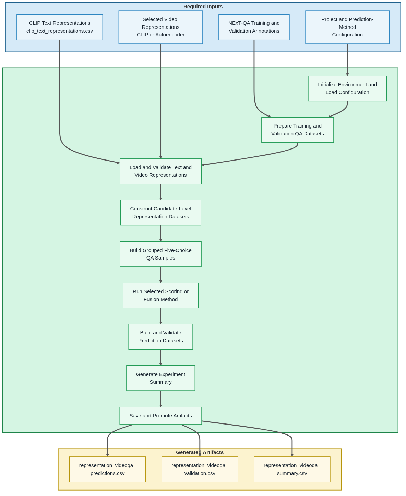

# 07 Run Representation VideoQA

<p>
  <strong>Open Notebook in Google Colab ➡️</strong>
  <a href="https://colab.research.google.com/github/pgailinas/videoqa-representation-comparison/blob/main/notebooks/07_Run_Representation_VideoQA.ipynb" target="_blank" rel="noopener noreferrer">
    
  </a>
</p>

## Purpose

This notebook performs representation-based VideoQA using precomputed text and video representations. Rather than performing direct multimodal inference, the notebook combines shared `clip_text` question–answer representations with either `clip_video` or `autoencoder_video` representations and applies the configured scoring or learned fusion method to generate multiple-choice predictions for the NExT-QA benchmark.

The notebook supports five prediction models:

- Cosine Similarity
- Fusion MLP Classifier
- Interaction Fusion Classifier
- Gated Fusion Classifier
- Bilinear Fusion Classifier

Each model produces one score for each of the five candidate answers. The five scores are passed to a shared prediction-generation stage, which selects the answer with the highest score.

Cosine similarity performs direct validation scoring without training a classifier and requires compatible text and video embedding dimensions. The four learned fusion models train on representation records from the NExT-QA training split and generate validation scores using distinct multimodal fusion strategies.

This design enables controlled comparison of both the video representation source and the mathematical strategy used to combine video and question-answer representations.

## Workflow Overview

The following diagram summarizes the notebook workflow, including the required inputs, primary processing stages, and generated output artifacts.

<a href="images/workflows/07_Run_Representation_VideoQA_workflow.png" target="_blank">
  
</a>

## Prediction Models

The notebook supports five prediction models ranging from a parameter-free similarity measure to four learned multimodal fusion classifiers. Each model produces five candidate scores for every question using the same video and question-answer representations, enabling direct comparison of different prediction strategies while holding the underlying representations constant.

For each question, the notebook compares one video representation with the five candidate question-answer representations.

Let:

- **v** denote the video embedding.
- **tᵢ** denote the embedding of candidate answer *i*.
- **sᵢ** denote the score assigned to candidate answer *i*.

Each prediction model produces the score vector

**s = [s₁, s₂, s₃, s₄, s₅]**

The shared prediction-generation stage selects the candidate with the highest score.

### Cosine Similarity

Cosine Similarity directly measures the semantic similarity between the video and each candidate question-answer embedding. Because it performs no training, it provides a simple baseline for evaluating the quality of pretrained representations.

**Score**

```
sᵢ = cosine(v, tᵢ)
```

---

### Fusion MLP Classifier

The video and text embeddings are first projected into a shared fusion space and then concatenated into a single multimodal representation. This approach allows the classifier to learn relationships between the two modalities that are not captured by cosine similarity alone. A multilayer perceptron (MLP) learns to assign a score to each candidate answer.

**Fusion**

```
xᵢ = [v′ ; tᵢ′]
```

**Score**

```
sᵢ = MLP(xᵢ)
```

---

### Interaction Fusion Classifier

Interaction Fusion extends the basic Fusion MLP by explicitly modeling relationships between the projected video and text embeddings using their difference and elementwise product. These interaction features explicitly encode agreement and disagreement between the projected video and text representations, providing richer information for classification.

**Fusion**

```
xᵢ = [v′ ; tᵢ′ ; |v′ − tᵢ′| ; v′ ⊙ tᵢ′]
```

**Score**

```
sᵢ = MLP(xᵢ)
```

where **⊙** denotes elementwise multiplication.

---

### Gated Fusion Classifier

Gated Fusion learns a feature-wise gating function that adaptively determines how much information to retain from the projected video and text representations before classification. This allows the classifier to emphasize whichever modality is more informative for each feature rather than weighting them equally.

**Fusion**

```
xᵢ = gᵢ ⊙ v′ + (1 − gᵢ) ⊙ tᵢ′
```

A gate value of **1** retains the corresponding video feature, a gate value of **0** retains the corresponding text feature, and intermediate values blend the two modalities.

**Score**

```
sᵢ = MLP(xᵢ)
```

---

### Bilinear Fusion Classifier

Bilinear Fusion models multiplicative interactions between the projected video and text representations, enabling the classifier to learn richer multimodal relationships than simple concatenation. Bilinear fusion is the most expressive of the five prediction models because it can learn feature-to-feature relationships between the projected video and text representations rather than treating them independently.

**Fusion**

```
xᵢ = v′ᵀ W tᵢ′
```

**Score**

```
sᵢ = MLP(xᵢ)
```

The four learned fusion classifiers are trained using grouped five-choice samples and cross-entropy loss.

### Prediction Model Comparison

### Prediction Model Comparison

The following table summarizes the characteristics of the five prediction models implemented in this notebook.

| Prediction Model | Trains a Classifier | Fusion Strategy | Loss Function | Primary Strength |
|------------------|:-------------------:|-----------------|---------------|------------------|
| **Cosine Similarity** | No | Direct semantic similarity | None | Simple baseline that evaluates the quality of pretrained representations without additional training. |
| **Fusion MLP** | Yes | Concatenation | Cross-Entropy | Learns nonlinear relationships between projected video and text representations. |
| **Interaction Fusion** | Yes | Concatenation, absolute differences, and elementwise products | Cross-Entropy | Explicitly models agreement and disagreement between the two modalities. |
| **Gated Fusion** | Yes | Learned feature-wise gating | Cross-Entropy | Learns how much to trust the video and text representations for each feature dimension. |
| **Bilinear Fusion** | Yes | Learned bilinear interactions | Cross-Entropy | Captures rich feature-to-feature relationships between the projected video and text representations. |

Cosine Similarity is a parameter-free scoring method and therefore does not require training or a loss function. The four learned fusion classifiers are trained as grouped five-choice multiple-choice classifiers using the cross-entropy loss function, which compares the predicted score distribution with the ground-truth answer during optimization.

Together, these prediction models provide a progression from a simple parameter-free similarity measure to increasingly expressive learned multimodal fusion strategies, enabling direct comparison of different approaches while using the same underlying video and text representations.

## Inputs

- NExT-QA training and validation annotations
- Shared CLIP text representations (`clip_text_representations.csv`)
- Selected CLIP or autoencoder video representations
- Project and prediction-method configuration

## Processing Summary

1. Initialize the notebook environment and load project configuration.
2. Prepare independent NExT-QA training and validation QA datasets.
3. Load and validate the shared CLIP text representations and selected video representations.
4. Construct candidate-level training and validation representation datasets.
5. Build grouped five-choice training and validation samples.
6. Run the selected prediction model:
   - direct cosine-similarity scoring, or
   - one of four learned multimodal fusion classifiers.
7. Produce a standardized five-score vector for each validation question.
8. Convert the score vectors into multiple-choice predictions.
9. Validate the prediction datasets and generate the completed experiment summary.
10. Save and promote the generated artifacts.

The supported prediction methods are cosine similarity, Fusion MLP, Interaction Fusion, Gated Fusion, and Bilinear Fusion. Cosine similarity performs validation-only scoring, while the learned fusion methods train on the NExT-QA training split and generate predictions for the validation split.

## Runtime Requirements

Cosine-similarity scoring is lightweight and can run efficiently on CPU.

The Fusion MLP, Interaction Fusion, Gated Fusion, and Bilinear Fusion classifiers may also run on CPU for small development experiments. A CUDA-capable GPU is recommended for full-split training because the learned models process grouped five-choice samples over multiple training epochs.

The notebook automatically selects CUDA when available and otherwise falls back to CPU. An NVIDIA L4 GPU is appropriate for the full training and validation workflow.

## Generated Artifacts

The notebook generates the following persistent artifacts for downstream evaluation in Notebook 08:

- `outputs/experiments/<experiment>/videoqa/representation_videoqa_predictions.csv`
- `outputs/experiments/<experiment>/videoqa/representation_videoqa_validation.csv`
- `outputs/experiments/<experiment>/videoqa/representation_videoqa_summary.csv`

## Notes

- Development mode selects a deterministic subset of unique videos independently from the training and validation splits while preserving all associated QA records.
- This notebook performs representation-based VideoQA using precomputed representations and does not perform direct Qwen2-VL multimodal inference.
- Prediction artifacts generated by this notebook are consumed by Notebook 08 using the same experiment-agnostic evaluation workflow as the Qwen2-VL baseline.

