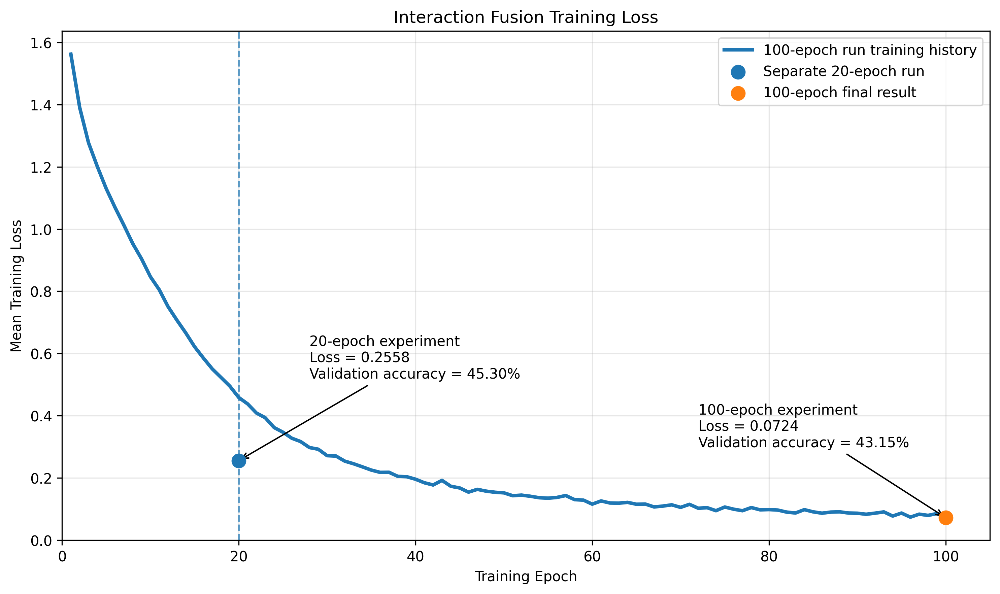

# Results and Insights

This page summarizes the experimental results obtained throughout the project and highlights the principal observations from comparing foundation-model, pretrained representation-based, and self-supervised representation-based VideoQA approaches.

---

## Baseline VideoQA Results

The Qwen2-VL baseline serves as the reference implementation for direct multimodal VideoQA reasoning. Unlike the representation-based methods, the baseline processes the original video frames directly and does not require additional representation learning or downstream classifier training.

| Experiment | Evaluation | Accuracy |
|------------|-----------:|---------:|
| Qwen2-VL Baseline | Development (100 videos) | **79.84%** |

The baseline substantially outperformed every representation-based method evaluated during this project and provides an approximate upper reference for the current experimental framework.

---

## Pretrained Representation Results

Shared CLIP text and video representations were generated once for the complete NExT-QA dataset and reused across all representation-based experiments.

### Development Experiments (100 Validation Videos)

| Method | Accuracy |
|--------|---------:|
| **Cosine Similarity** | **44.12%** |
| **Interaction Fusion** | **27.10%** |
| **Bilinear Fusion** | **26.32%** |
| **Fusion MLP** | **23.85%** |
| **Gated Fusion** | **22.17%** |

The development experiments were intentionally performed on a reduced 100-video validation subset to validate the notebook workflow, compare prediction methods, and identify promising configurations before executing full-validation experiments. Although the absolute accuracies differ from the full-validation results, the development experiments correctly identified the strongest fusion architectures for subsequent evaluation.

### Full Validation Experiments

| Method | Accuracy |
|--------|---------:|
| **Bilinear Fusion** | **46.42%** |
| **Interaction Fusion** | **45.30%** |
| **Cosine Similarity** | **44.18%** |
| **Gated Fusion** | **41.61%** |
| **Fusion MLP** | **34.21%** |

Several important observations emerged from the full-validation experiments:

- Bilinear Fusion achieved the highest overall representation-based accuracy.
- Interaction Fusion also surpassed the zero-shot cosine similarity baseline.
- Cosine Similarity remained remarkably stable between development and full-validation experiments, demonstrating that the 100-video development subset provided a representative estimate of full-validation performance.
- Gated Fusion improved substantially with additional training data but did not exceed the cosine similarity baseline.
- The standard Fusion MLP produced the weakest learned classifier performance, indicating that simple multimodal concatenation is less effective than explicit cross-modal interaction modeling.

---

## Interaction Fusion Training Analysis

To investigate whether additional training could further improve representation-based VideoQA performance, the Interaction Fusion classifier was trained for **100 epochs** using the complete NExT-QA training split. The canonical experiment used throughout this project employed **20 training epochs**, which achieved the highest validation accuracy of **45.30%**.

Figure 1 compares the final training loss obtained by the 20-epoch and 100-epoch experiments. Although continued optimization reduced the training loss from **0.2558** to **0.0724**, the corresponding validation accuracy decreased from **45.30%** to **43.15%**. This behavior indicates that the model continued fitting the training data while losing generalization performance on unseen validation samples.

  

<b>Figure 1.</b> Interaction Fusion training-loss comparison. The curve represents the 100-epoch training run, while the highlighted marker at epoch 20 corresponds to the final result of the separate canonical 20-epoch experiment. Although additional training substantially reduced training loss, validation accuracy declined from 45.30% to 43.15%, providing evidence of overfitting.

Based on these observations, **20 epochs** was retained as the default training configuration for all reported Interaction Fusion experiments presented in this repository.

---

## Autoencoder Representation Results

The self-supervised autoencoder pipeline was evaluated using learned video representations combined with shared CLIP question-answer representations.

| Method | Accuracy |
|--------|---------:|
| Autoencoder + Fusion MLP (Development, 100 videos) | **23.46%** |
| Autoencoder + Fusion MLP (Development, 500 videos) | **21.78%** |

Although the autoencoder successfully learned compact latent video representations, increasing the development training set from 100 to 500 videos did not improve downstream VideoQA accuracy. The larger experiment achieved 21.78% accuracy compared with 23.46% for the smaller development experiment, suggesting that the current representation-learning approach, rather than the amount of development data, is the primary performance limitation. These results indicate that the current reconstruction-based representation learning approach, rather than the amount of development data, is the primary limitation on downstream VideoQA performance.

---

## Runtime and Workflow Observations

Experiments were conducted using Google Colab GPU runtimes throughout the project.

Several practical observations improved the efficiency and reproducibility of the experimental workflow:

- Qwen2-VL inference executed reliably on NVIDIA L4 GPU runtimes.
- NVIDIA T4 runtimes occasionally experienced CUDA out-of-memory errors during Qwen2-VL inference.
- Representation-based classifier training benefited substantially from GPU acceleration.
- Shared CLIP text and video representations were generated only once and reused across all subsequent experiments.
- Separating representation generation from downstream VideoQA evaluation substantially reduced experimentation time by allowing multiple prediction methods to be evaluated without regenerating video representations.
- The modular notebook design enabled new experiments to be executed primarily through configuration changes rather than code modifications.

---

## Representation Analysis

The experiments demonstrate that pretrained CLIP representations provide a strong semantic embedding space for VideoQA.

Zero-shot cosine similarity achieved more than 44% validation accuracy without any supervised classifier training, indicating that CLIP's pretrained alignment between visual and textual representations transfers effectively to multiple-choice VideoQA.

Learned multimodal fusion methods produced mixed results. Interaction-based architectures consistently outperformed simple feature concatenation, indicating that explicit cross-modal modeling is important when combining video and text representations.

---

## Reasoning Category Analysis

Notebook 08 provides per-category evaluation metrics and error analysis across all completed experiments. These analyses help identify strengths and weaknesses for different VideoQA reasoning categories and provide insight into the types of questions that remain challenging for representation-based approaches.

---

## Representation Comparison

The completed experiments provide a direct comparison between all evaluated representation-based approaches.

| Rank | Method | Accuracy |
|-----:|--------|---------:|
| 1 | Bilinear Fusion | **46.42%** |
| 2 | Interaction Fusion | **45.30%** |
| 3 | Cosine Similarity | **44.18%** |
| 4 | Gated Fusion | **41.61%** |
| 5 | Fusion MLP | **34.21%** |
| 6 | Autoencoder + Fusion MLP (Development, 100 videos) | **23.46%** |
| 7 | Autoencoder + Fusion MLP (Development, 500 videos) | **21.78%** |

The ranking illustrates the performance differences among the evaluated representation-based approaches. Bilinear Fusion achieved the highest representation-based accuracy, while the current reconstruction-based autoencoder representations produced substantially lower downstream performance.

---

## Key Findings

The completed experiments support the following scientific conclusions:

- Qwen2-VL achieved the highest overall VideoQA accuracy.
- Pretrained CLIP representations substantially outperformed the evaluated self-supervised autoencoder representations.
- Bilinear Fusion achieved the highest representation-based VideoQA accuracy.
- Interaction Fusion surpassed the zero-shot cosine similarity baseline after supervised training.
- Extending Interaction Fusion training from 20 to 100 epochs reduced training loss but also reduced validation accuracy, demonstrating overfitting rather than undertraining.
- Increasing the autoencoder development experiment from 100 to 500 videos did not improve downstream VideoQA accuracy, indicating that representation quality rather than training-set size was the dominant limitation.
- Across all representation-based experiments, semantic representation quality had a greater influence on VideoQA performance than the choice of downstream prediction model.

---

## Lessons Learned

Several engineering decisions contributed significantly to the success of the project:

- Generating shared CLIP representations only once dramatically reduced experimentation time.
- Standardized prediction artifacts enabled Notebook 08 to evaluate multiple experiments without modification.
- A modular notebook workflow allowed new representation-learning experiments to be executed with minimal code changes.
- Development-mode experiments effectively identified promising prediction methods before committing to computationally expensive full-validation experiments.
- Maintaining a common evaluation framework simplified direct comparison among competing representation-learning approaches.

---

## Future Work

The experimental results suggest several promising directions for future investigation:

- Develop semantic-alignment techniques that encourage reconstruction-based autoencoder representations to align with pretrained CLIP embedding spaces.
- Investigate teacher--student learning, projection networks, and contrastive alignment objectives for improving self-supervised video representations.
- Evaluate larger latent dimensions, transformer-based video encoders, and alternative self-supervised learning objectives.
- Explore hybrid representations that combine reconstruction-based and pretrained semantic embeddings.
- Extend evaluation to additional VideoQA benchmark datasets and the complete NExT-QA test split.

