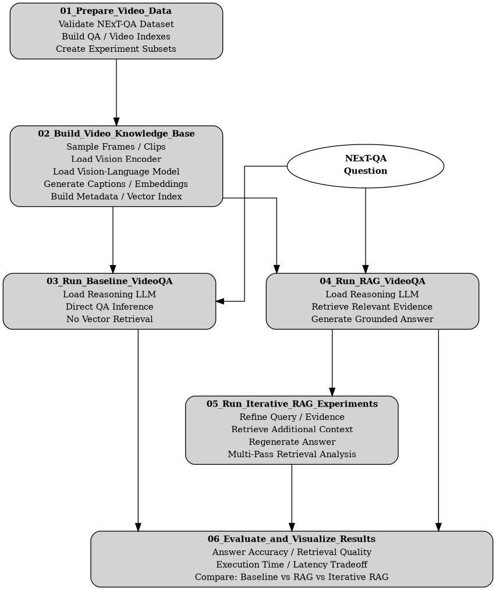

# Video Question Answering Research Framework

## Project Overview

This project investigates Retrieval-Augmented Generation (RAG) techniques for Video Question Answering (VideoQA) through comparative evaluation of multimodal retrieval, embedding, and large language model (LLM) reasoning strategies across video understanding pipelines.

The research framework integrates video preprocessing, frame and clip retrieval, multimodal embedding generation, vector database indexing, and LLM-based inference to study how retrieval architectures influence contextual grounding, temporal reasoning, and question-answering performance within VideoQA systems.

The repository provides a reproducible experimental environment for evaluating baseline and RAG-enhanced VideoQA approaches using public datasets, modular notebook-driven workflows, and configurable multimodal AI components. The project is publicly available through GitHub and supports execution in Google Colab or local Jupyter environments, enabling research-oriented experimentation and future IEEE-style publication development.

## Motivation and Research Problem

The rapid growth of video-based data has created increasing demand for AI systems capable of understanding visual scenes, temporal sequences, motion, and contextual relationships distributed across long video streams. Unlike static-image understanding, VideoQA requires multimodal reasoning across both spatial and temporal information, making it a challenging benchmark for evaluating long-context inference, contextual grounding, and LLM integration.

Recent RAG approaches have introduced scalable methods for grounding LLM reasoning in relevant video content through retrieval of frames, clips, captions, transcripts, and multimodal embeddings prior to inference. These methods aim to improve contextual accuracy and reduce hallucinations during question answering across complex video sequences.

Despite recent advances in multimodal AI, significant research challenges remain involving temporal grounding, embedding selection, iterative evidence refinement, and the interaction between multimodal retrieval architectures and LLM-based reasoning within VideoQA systems. This project investigates these challenges through comparative evaluation of baseline and RAG-enhanced VideoQA pipelines across multiple retrieval and inference configurations.

## Research Objectives

This project investigates how RAG architectures influence VideoQA performance across multimodal video understanding systems. The research emphasizes comparative evaluation of baseline and RAG-enhanced pipelines using different frame- and clip-retrieval strategies, multimodal embedding approaches, and LLM inference configurations.

The objectives of this work include evaluating how retrieval granularity, embedding selection, and iterative evidence refinement influence temporal reasoning, contextual grounding, retrieval quality, and question-answering accuracy across multiple public VideoQA datasets. Comparative experiments analyze baseline LLM inference without retrieval, single-pass RAG pipelines, and iterative RAG workflows incorporating recursive evidence refinement across frames, clips, captions, and transcript representations.

Additional objectives include measuring how different retrieval strategies and embedding configurations affect answer accuracy, contextual relevance, retrieval precision, and inference behavior within multimodal VideoQA systems. The project also investigates the interaction between retrieval architectures and LLM-based reasoning across varying video domains, question types, and multimodal inference workflows.

## Datasets

Public VideoQA benchmark datasets, including MSVD-QA and TGIF-QA, are used to evaluate baseline and RAG-enhanced video understanding pipelines. These datasets provide annotated video samples, captions, and question-answer pairs spanning diverse visual scenes, actions, temporal relationships, and contextual reasoning tasks.

The selected datasets support comparative evaluation of multimodal retrieval, temporal reasoning, contextual grounding, and LLM-based inference across different video domains and question types. Their combination provides a reproducible benchmark environment for investigating retrieval architectures, embedding strategies, and VideoQA performance under varying retrieval and reasoning configurations.

## System Architecture

The experimental VideoQA framework integrates multimodal retrieval, embedding generation, vector database indexing, and LLM-based inference to support comparative evaluation of baseline and RAG-enhanced video understanding pipelines.

Raw video inputs are processed into frames and short clips for multimodal feature extraction. Pretrained multimodal models generate visual embeddings, captions, and optional transcript representations, which are indexed within a vector database to support similarity-based retrieval during inference.

At query time, natural-language questions are converted into query embeddings and matched against indexed video representations to retrieve relevant frames, clips, captions, or transcript segments. The retrieved evidence is then provided to a LLM to generate contextually informed responses.

The architecture supports evaluation of multiple retrieval strategies, embedding configurations, and inference workflows, including both baseline and iterative RAG approaches. This design enables comparative analysis of how multimodal retrieval systems influence contextual grounding, temporal reasoning, and VideoQA performance.

---

### Pipeline Flowchart

## Experimental Methodology

The experimental framework evaluates baseline VideoQA pipelines alongside RAG-enhanced approaches using multiple retrieval configurations, multimodal embedding strategies, and LLM inference workflows. Comparative analysis is performed across frame-level, clip-level, and multimodal evidence representations to investigate their impact on question-answering accuracy, temporal reasoning, contextual grounding, and retrieval effectiveness.

The methodology includes evaluation of baseline multimodal models and LLM inference workflows without external retrieval, as well as single-pass and iterative RAG pipelines incorporating recursive evidence refinement across frames, clips, captions, and transcript representations. Representative baseline and multimodal components may include architectures such as CLIP, BLIP-2, Video-LLaVA, Qwen-VL, and related vision-language models integrated within retrieval and inference workflows.

Experiments are designed to analyze how retrieval granularity, embedding selection, vector similarity search strategies, and iterative inference behavior influence VideoQA performance across multiple benchmark datasets and retrieval architectures. Evaluation metrics may include answer accuracy, retrieval precision and recall, semantic similarity measures, contextual relevance, and comparative inference performance across baseline and RAG-enhanced systems.

## Implementation Framework

The implementation framework integrates open-source multimodal models, vector databases, and Python-based AI frameworks to support reproducible VideoQA experimentation across baseline and RAG-enhanced inference pipelines. The framework is designed to support modular evaluation of multimodal embeddings, retrieval configurations, vector indexing strategies, and LLM-based reasoning workflows within both Google Colab and local development environments.

The implementation incorporates pretrained vision-language models, multimodal LLMs, vector similarity search systems, and GPU-accelerated inference libraries to support scalable multimodal retrieval and inference experiments. Supporting technologies include PyTorch, Hugging Face Transformers, LangChain, FAISS, ChromaDB, OpenCV, and related libraries used for feature extraction, embedding generation, vector indexing, retrieval, and experimental evaluation.

## Repository Organization

The repository is organized as a modular notebook-driven research environment designed to support reproducible VideoQA experimentation and comparative evaluation workflows. The structure separates dataset preparation, media extraction, embedding generation, vector indexing, retrieval pipelines, inference workflows, evaluation procedures, and visualization stages into independently executable notebooks and configuration modules.

The repository organization emphasizes scalable dataset management, reusable configuration infrastructure, reproducible experiment execution, and clear separation between preprocessing, retrieval, inference, evaluation, and analysis stages. Supporting directories include benchmark datasets, extracted media assets, metadata resources, vector indexes, generated embeddings, experimental outputs, figures, configuration modules, and documentation resources intended to support extensible multimodal AI research workflows.

## Expected Contributions

This work contributes a reproducible experimental framework for investigating RAG architectures within VideoQA systems. The research is designed to provide comparative insight into multimodal retrieval strategies, embedding configurations, iterative evidence refinement, and LLM-based reasoning across temporally complex video understanding tasks.

The experimental framework supports systematic evaluation of baseline and RAG-enhanced inference pipelines across multiple benchmark datasets and retrieval configurations. Expected contributions include comparative performance benchmarks, retrieval and inference analysis visualizations, and architectural insights into the interaction between multimodal retrieval systems and LLM-based reasoning within VideoQA environments.

The repository additionally provides an extensible multimodal AI research platform designed to support future experimentation involving vector databases, multimodal embeddings, retrieval architectures, and scalable video inference workflows.

---

## References and Further Reading

Additional papers, datasets, models, and technical resources related to this project are available on the [References and Further Reading](References.md) page.

---

## Author

**Phil Gailinas**  
- M.S. Computer Engineering candidate  
- University of New Mexico
- Project initiated 05-20-2026

## License

This project is intended for academic and research use.

